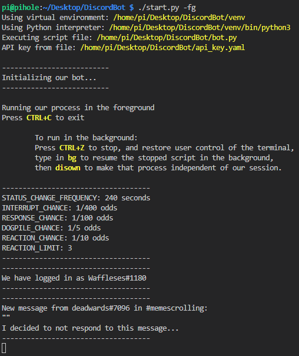
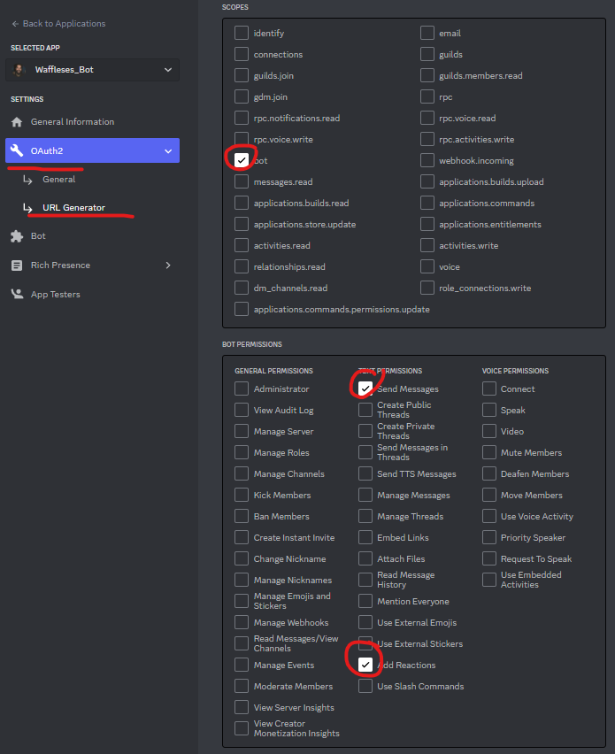
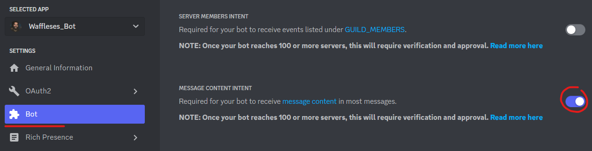

# Overview
A Discord bot meant to replicate one of our friends who became too involved with 
World of Warcraft to interact with the real world. Bot reactions are artisan-crafted to mimic the delicate, yet sophisticated idiocy of our beloved friend.
It honestly fills the void surprisingly well. Raising questions about how much
of a real person they were to begin with... :thinking:

So what's it actually do? 

1. Based on specific key words and phrases, it'll respond in a manner similar to what our friend might say. 

2. It may periodically interrupt someone's typing with some rude garbage.

3. Randomly, it'll reply to any message with a message of its own.

4. Randomly, it'll analyze the text of any message and react with similar emoji.

5. When a user reacts to a message, it'll periodically dogpile additional emoji reactions onto it.

6. Every so often, it'll change the "Game" listed under the bot's username with a goofy mockery of a typical activity.

7. All actions the bot takes are done to simulate a user's input. Text responses will show the bot "typing" for time roughly matching the length of the message, and emoji reactions will take a few seconds to be applied.

# Set up your Discord Bot "Application" and grab an API key
Go to the [Discord developer portal](https://discord.com/developers/applications) and create a new "app" for your bot user. For official instructions, [read the official discord.py docs](https://discordpy.readthedocs.io/en/latest/discord.html).

Add your new bot to your Discord server and ensure it has the correct permissions for posting messaging and adding reactions.

**Note:** Be sure to enable the **"Message Content Intent"** on your bot. As of August 2022, [Discord requires this setting in order for bot accounts to read the text of a message](https://support-dev.discord.com/hc/en-us/articles/4404772028055).

# Installation

## 1. Ensure that you have "Python 3" installed
Mac and Linux probably have it installed by default. Windows is windows...

## 2. Download or clone this GitHub repo
Simple enough.

## 3. Apply your Discord App API Key to your bot
You can add the api key to the **"api_key.yaml"** file or you can set it within the bot.py script itself, on the **API_KEY** variable at the top of the script. Either way. Since API keys should never be shared, the **"api_key.yaml"** file could offer better security, with file permissions or other wackiness. But that's ultimately up to you.

## 4. Install the required python libraries
First, `cd` into the downloaded directory for the following steps. Should go without saying, but I said it anyway.

### **Option 1:**  Install globally.

1. Install our pip requirements

       python3 -m pip install -r requirements.txt

    You're done.

### **Option 2:**  Set up a **"virtual environment"** to contain everything the bot needs, within its own sandbox. Debatably better. Particularly if you have a lot of temperamental "stuff" running on your machine. *E.G. If it's a server*. You don't want the version of these libraries to conflict with other app requirements. Since I don't know what's running on your machine, I recommend this method.
1. [Install "virtual env" on your machine](https://packaging.python.org/en/latest/guides/installing-using-pip-and-virtual-environments/)

2. Create a virtual environment for Python 3

        virtualenv -p python3 venv

    1. Initialize our new virtual env
        
            source env/bin/activate

    2. Install our pip requirements within this new sandbox environment

            python3 -m pip install -r requirements.txt

# Running the Bot
### **Option 1:** 
When you're ready, you basically just run the `bot.py` script with `python3`. If you set everything correctly, it should grab your API key and connect to your Discord Server(s) as the bot user you set up on the Discord Dev website.

    python3 bot.py

### **Option 2:** 
If you've set up a virtual env, you can run the convenience `start.py` script, instead of having to jump through the hoops of **initializing** the env, **running the bot** command, and **backgrounding it** each and every time you want to run it. Options are available if your want to see the bot's output in a foreground process. *(Use the `-fg` or `--foreground` args)*

By default it kicks the process into the background.

    ./start.py
    ./start.py -fg
    ./start.py --foreground

# Stopping the Bot
Need to stop a bot that's running in the background? For convenience, there's a quick `stop.py` script to kill the process, in the somewhat-likely event of a robot apocalypse. Of course, you can also find it with the task manager, activity monitor, `top` or `htop`, and kill the bot.py processes the normal way.

    ./stop.py

# Configuring the Bot
If you've launched the bot in the foreground, the console should now display all messages and reactions which the bot is allowed to see, and any actions that the bot took upon them.

Dial-in how often you want the bot to react to specific events using the variables at the very top of the `bot.py` script. Then simply **quit**, and **re-launch** the bot to pick up the changes. Experiment with some values that match the chattiness of your particular Discord server(s).

Of course, why stop at dialing-in numbers!? You can edit the trigger words and responses to suit your needs! Once you break down your friends' speach patterns, it's shockingly easy to mimic them with code. After all, what is a man, really? Speaking of which, it's probably a great time to mention machine learning. This script can easily be adapted to feed text into a neural net, and post responses back into the Discord server(s). It's easier than you think, but is beyond the scope of this simple project. [You can read more on that topic over here](https://platform.openai.com/docs/guides/completion/introduction).
